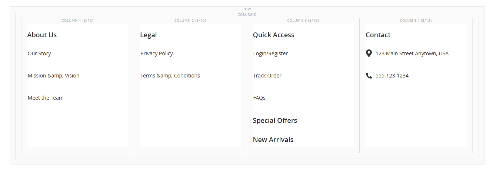
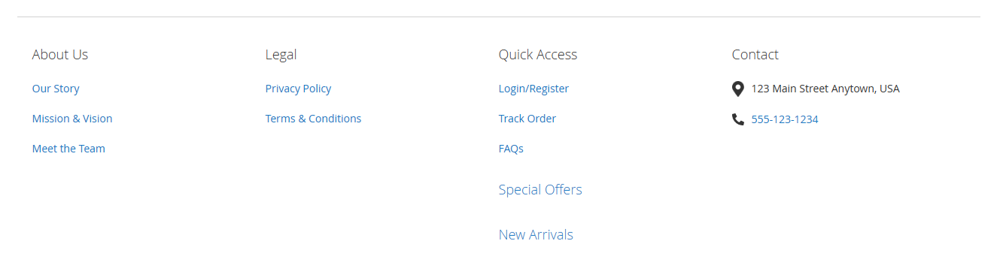

# Magento 2 Footer Content Type Module

This Magento 2 module adds a new content type, making it easy to create footers using Page Builder. This module simplifies adding links to your footers. It also includes the functionality of an accordion on the frontend.

## Installation

1. Install via Composer:
```
composer require devgfnl/module-page-builder-footer
```

2. Enable the module:
```
bin/magento module:enable DEVGFNL_PageBuilderFooter
bin/magento setup:upgrade
```

## How to Use

1. Navigate to the Page Builder section in your Magento 2 admin panel.
2. Create or edit a page/block where you want to add a footer.
3. Add a new content type and select "Footer Item" from the available options.
4. Customize your footer content using the intuitive Page Builder interface.
5. Easily add links to your footer item.
6. Save your changes and enjoy your newly designed footer!

## Example




For any inquiries or assistance, please [open an issue](https://github.com/GabrielFNLima/magento-page-builder-footer/issues) on GitHub.
